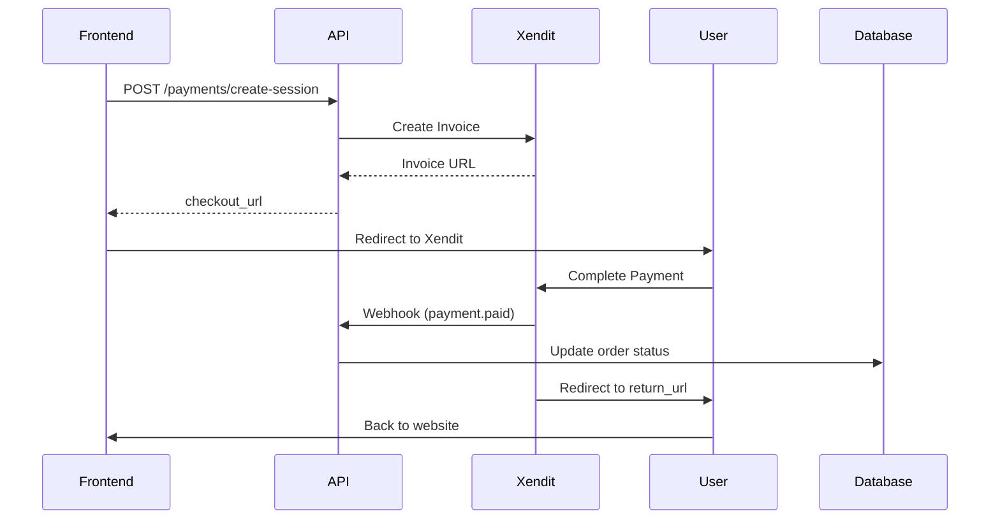
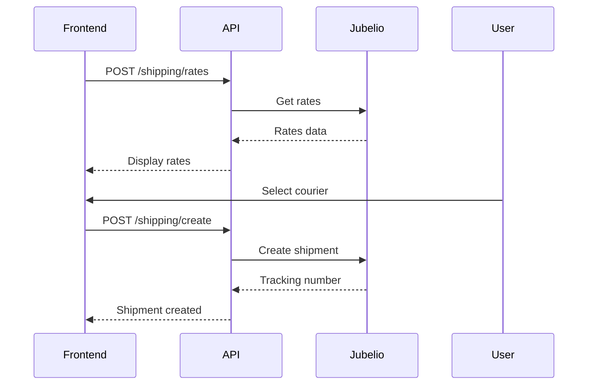

# API Documentation - Payment & Shipment Service

Base URL: `https://api-payment.regalpaw.id/api`

## 🔐 Authentication

Semua endpoint (kecuali webhooks) memerlukan API Key di header:

```javascript
headers: {
  'x-api-key': 'your-api-key-here',
  'Content-Type': 'application/json'
}
```

---

## 💳 Payment APIs

### 1. Create Payment Session

Membuat session pembayaran baru untuk order.

**Endpoint:** `POST /payments/create-session`

**Headers:**

```javascript
{
  'Content-Type': 'application/json'
  // No API key required (public endpoint)
}
```

**Request Body:**

**Option A - Dengan Order ID (dari database):**

```javascript
{
  "order_id": "ORDER123",           // Required
  "return_url": "https://regalpaw.id/payment/success",  // Optional
  "payment_method": "EWALLET",       // Optional: EWALLET, BANK_TRANSFER, QRIS, CARD
  "payment_channel": "SHOPEEPAY"     // Optional: SHOPEEPAY, OVO, DANA, BCA, etc
}
```

**Option B - Test Mode (tanpa order di database):**

```javascript
{
  "test": true,
  "order": {
    "total": 100000,                 // Amount in IDR
    "total_amount": 100000           // Alias untuk total
  },
  "return_url": "https://regalpaw.id/payment/success",
  "payment_method": "QRIS"
}
```

**Response:**

```javascript
{
  "provider": "xendit",
  "session_id": "invoice_id_from_xendit",
  "checkout_url": "https://checkout.xendit.co/web/invoice_id",
  "url": "https://checkout.xendit.co/web/invoice_id"  // Alias
}
```

**Usage Example:**

```javascript
// React/Vue/Vanilla JS
async function createPayment(orderId) {
  const response = await fetch(
    "https://api-payment.regalpaw.id/api/payments/create-session",
    {
      method: "POST",
      headers: {
        "Content-Type": "application/json",
      },
      body: JSON.stringify({
        order_id: orderId,
        return_url: `${window.location.origin}/payment/success`,
        payment_method: "EWALLET",
        payment_channel: "SHOPEEPAY",
      }),
    }
  );

  const data = await response.json();

  // Redirect user ke checkout page
  window.location.href = data.checkout_url;
}
```

**Payment Methods Available:**

| Method          | Channel Options                           |
| --------------- | ----------------------------------------- |
| `EWALLET`       | `SHOPEEPAY`, `OVO`, `DANA`, `LINKAJA`     |
| `BANK_TRANSFER` | `BCA`, `BNI`, `MANDIRI`, `BRI`, `PERMATA` |
| `QRIS`          | Auto-detect (DANA, GoPay, OVO, etc)       |
| `CARD`          | Credit/Debit cards                        |
| `RETAIL_OUTLET` | `ALFAMART`, `INDOMARET`                   |

---

### 2. Get Invoice Details

Mendapatkan detail invoice/payment.

**Endpoint:** `GET /invoices/:invoiceId`

**Headers:**

```javascript
{
  'x-api-key': 'your-api-key-here'
}
```

**Response:**

```javascript
{
  "id": "invoice_id",
  "external_id": "order-123",
  "status": "PAID",  // PENDING, PAID, EXPIRED
  "amount": 100000,
  "invoice_url": "https://checkout.xendit.co/...",
  "payment_method": "EWALLET",
  "payment_channel": "SHOPEEPAY",
  "paid_at": "2025-11-16T12:00:00Z",
  "created": "2025-11-16T11:00:00Z"
}
```

---

## 📦 Shipping APIs

### 3. Get Shipping Rates

Mendapatkan estimasi ongkir untuk berbagai kurir.

**Endpoint:** `GET /shipping/rates` (Legacy - Recommended)

**Headers:**

```javascript
{
  // No authentication required (public endpoint)
}
```

**Query Parameters:**

```javascript
?to_postal=12345&weight=1000&origin_postal=10110
```

- `to_postal` (required): Kode pos tujuan
- `weight` (required): Berat dalam gram
- `origin_postal` (optional): Kode pos asal (default dari config)

**Response:**

```javascript
[
  {
    "provider": "JNE",
    "service_code": "REG",
    "service_name": "REG",
    "cost": 15000,
    "etd": "2-3 hari",
    "currency": "IDR"
  },
  {
    "provider": "JNT",
    "service_code": "EZ",
    "service_name": "EZ",
    "cost": 12000,
    "etd": "3-4 hari",
    "currency": "IDR"
  }
]
```

**Usage Example:**

```javascript
async function getShippingRates(toPostal, weight) {
  const params = new URLSearchParams({
    to_postal: toPostal,
    weight: weight.toString(),
  });

  const response = await fetch(
    `https://api-payment.regalpaw.id/api/shipping/rates?${params}`
  );

  return await response.json(); // Returns array directly
}
```

---

### 4. Create Shipment

Membuat order pengiriman (booking kurir).

**Endpoint:** `POST /shipping/create-shipment` (Legacy - Protected)

**Headers:**

```javascript
{
  'x-api-key': 'your-api-key-here',
  'Content-Type': 'application/json'
}
```

**Request Body:**

```javascript
{
  "order_id": "ORDER123",            // Required
  "provider": "JNE",                 // Required: JNE, JNT, SICEPAT, etc
  "service_code": "REG",             // Required: Service code dari shipping rates
  "address": {
    "name": "John Doe",
    "phone": "+6281234567890",
    "address1": "Jl. Sudirman No. 123",
    "city": "Jakarta Pusat",
    "postal_code": "12345",
    "area_id": "123456"              // Required dari /region/areas
  },
  "parcels": [                       // Required
    {
      "weight_gram": 1000,           // Berat total dalam gram
      "length_cm": 10,               // Optional
      "width_cm": 10,                // Optional
      "height_cm": 10,               // Optional
      "value_idr": 100000            // Optional: nilai barang
    }
  ]
}
```

**Response:**

```javascript
{
  "shipment_id": "SHIP123",
  "tracking_number": "JP1234567890",
  "raw": {
    "id": "SHIP123",
    "tracking_number": "JP1234567890",
    "carrier": "JNE",
    "service": "REG",
    "status": "created"
  }
}
```

---

## 🌍 Region/Area APIs

### 5. Search Regions

⚠️ **DISABLED** - Endpoint ini di-disable untuk mencegah OOM error.

**Gunakan Hierarchical Endpoints sebagai gantinya:**

1. Get Provinces → `GET /region/provinces`
2. Get Cities → `GET /region/cities/:province_id`
3. Get Districts → `GET /region/districts/:city_id`
4. Get Areas → `GET /region/areas/:district_id`

**Usage Example:**

```javascript
// Step-by-step region selection
async function getRegionHierarchy() {
  // 1. Get provinces
  const provinces = await fetch(
    'https://api-payment.regalpaw.id/api/region/provinces'
  ).then(r => r.json());
  
  // 2. Get cities by province
  const cities = await fetch(
    `https://api-payment.regalpaw.id/api/region/cities/${provinceId}`
  ).then(r => r.json());
  
  // 3. Get districts by city
  const districts = await fetch(
    `https://api-payment.regalpaw.id/api/region/districts/${cityId}`
  ).then(r => r.json());
  
  // 4. Get areas (kelurahan) by district - RETURN area_id!
  const areas = await fetch(
    `https://api-payment.regalpaw.id/api/region/areas/${districtId}`
  ).then(r => r.json());
  
  // Use area.area_id for shipping!
  return areas;
}
```

---

### 6. Get Provinces

**Endpoint:** `GET /region/provinces`

**Response:**

```javascript
[
  {
    province_id: "1",
    name: "DKI Jakarta",
  },
  {
    province_id: "2",
    name: "Jawa Barat",
  },
];
```

---

### 7. Get Cities by Province

**Endpoint:** `GET /region/cities/:province_id`

**Response:**

```javascript
[
  {
    city_id: "1",
    province_id: "1",
    name: "Jakarta Pusat",
  },
];
```

---

### 8. Get Districts by City

**Endpoint:** `GET /region/districts/:city_id`

---

### 9. Get Areas by District

**Endpoint:** `GET /region/areas/:district_id`

**Response:**

```javascript
[
  {
    area_id: "123456",
    name: "Kelapa Gading",
    zipcode: "14240",
  },
];
```

---

## 🔔 Webhooks (For Backend Integration)

Xendit akan mengirim webhook ke backend ketika ada event pembayaran.

### Payment Webhook Endpoints:

| Webhook Type | Endpoint                   | Events                             |
| ------------ | -------------------------- | ---------------------------------- |
| Invoice      | `/webhooks/xendit`         | Invoice paid, expired, pending     |
| FVA          | `/webhooks/xendit/fva`     | FVA created, FVA paid              |
| E-Wallet     | `/webhooks/xendit/ewallet` | Payment succeeded, pending, failed |
| QR/QRIS      | `/webhooks/xendit/qr`      | QR paid, refunded                  |

**Webhook Verification:**

Semua webhook di-verify menggunakan `x-callback-token` header yang harus match dengan `XENDIT_WEBHOOK_TOKEN`.

---

## 🚀 Complete Frontend Integration Example

### React Example:

```javascript
import { useState } from "react";

const API_BASE = "https://api-payment.regalpaw.id/api";

// 1. Create Payment
async function createPayment(orderId) {
  const res = await fetch(`${API_BASE}/payments/create-session`, {
    method: "POST",
    headers: { "Content-Type": "application/json" },
    body: JSON.stringify({
      order_id: orderId,
      return_url: `${window.location.origin}/payment/callback`,
      payment_method: "EWALLET",
      payment_channel: "SHOPEEPAY",
    }),
  });

  const data = await res.json();
  window.location.href = data.checkout_url;
}

// 2. Get Shipping Rates
async function getShippingRates(toPostal, weight) {
  const params = new URLSearchParams({
    to_postal: toPostal,
    weight: weight.toString()
  });
  
  const res = await fetch(`${API_BASE}/shipping/rates?${params}`);
  return await res.json(); // Returns array directly
}

// 3. Get Areas (untuk dapatkan area_id)
async function getAreas(districtId) {
  const res = await fetch(
    `${API_BASE}/region/areas/${districtId}`
  );
  return await res.json();
}

// Component Example
function CheckoutPage() {
  const [rates, setRates] = useState([]);

  async function handleGetRates(postal, weight) {
    const ratesArray = await getShippingRates(postal, weight);
    setRates(ratesArray); // Already an array
  }

  async function handlePayment(orderId) {
    await createPayment(orderId);
  }

  return (
    <div>
      <button onClick={() => handleGetRates("12345", 1000)}>
        Get Shipping Rates
      </button>
      <button onClick={() => handlePayment("ORDER123")}>Pay Now</button>

      {rates.map((rate) => (
        <div key={rate.service_code}>
          {rate.provider} - {rate.service_code}: Rp {rate.cost}
        </div>
      ))}
    </div>
  );
}
```

---

## 📱 Payment Flow



---

## 🛒 Shipping Flow



---

## ⚠️ Error Handling

**Error Response Format:**

```javascript
{
  "error": "Error message here"
}
```

**Common HTTP Status Codes:**

| Code | Meaning                        |
| ---- | ------------------------------ |
| 200  | Success                        |
| 201  | Created                        |
| 400  | Bad Request (invalid input)    |
| 401  | Unauthorized (invalid API key) |
| 404  | Not Found                      |
| 500  | Internal Server Error          |

**Example Error Handling:**

```javascript
try {
  const response = await fetch(url, options);

  if (!response.ok) {
    const error = await response.json();
    throw new Error(error.error || "Request failed");
  }

  return await response.json();
} catch (error) {
  console.error("API Error:", error.message);
  // Show error to user
}
```

---

## 🔒 Security Best Practices

1. **Never expose API Key di frontend** untuk protected endpoints
2. Gunakan HTTPS untuk semua requests
3. Validate user input sebelum kirim ke API
4. Handle errors dengan baik
5. Implement retry logic untuk network failures
6. Cache shipping rates untuk improve performance

---

## 📞 Support

Jika ada masalah atau pertanyaan:

- Check Railway logs untuk server errors
- Verify API key valid dan tidak expired
- Ensure request format sesuai dokumentasi
- Test dengan Postman/curl terlebih dahulu

---

**Last Updated:** November 16, 2025
